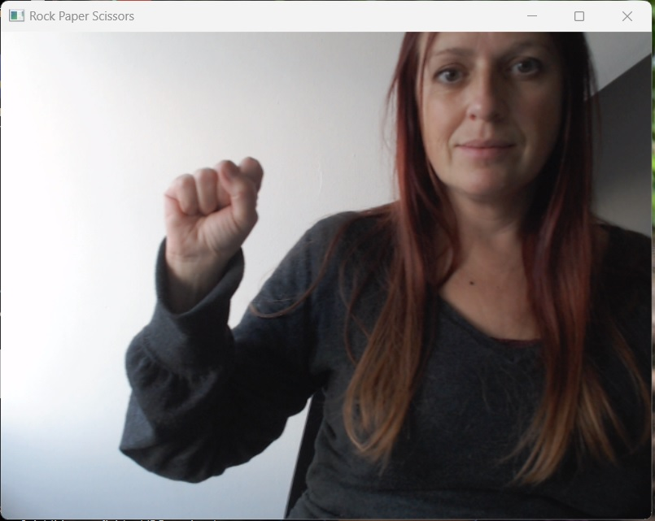
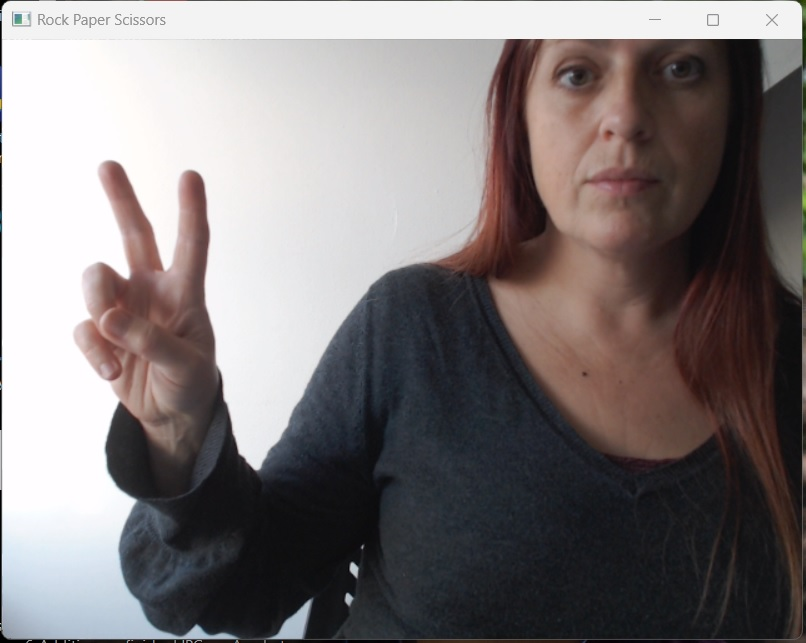

# Computer Vision Rock Paper Scissors Game
Rock-Paper-Scissors is a game in which each player simultaneously shows one of three hand signals representing rock, paper, or scissors. Rock beats scissors. Scissors beats paper. Paper beats rock. The player who shows the first option that beats the other player's option wins. This is an implementation of an interactive Rock-Paper-Scissors game, in which the user can play with the computer using the camera. 

## Milestone_2
Using Teachable Machines, I have created an image project model with four classes: Rock, Paper, Scissors and None.
In a future milestone, I will use this model to receive user input from the camera.

## Milestone_4
The manual_rps.py file contains the code to play the rock paper scissors game, with the user typing "rock", "paper" or "scissors".
The computer chooses one of the words at random. The user-selected word is compared with the computer-selected word to determine whether the user or computer has won the game.

## Milestone_5
Libraries used:
- cv2
- load_model
- numpy
- time
- random

This game uses OpenCV to take a frame from the webcam each five seconds and interpret the image, using keras.models, to determine whether the user is showing "rock", "paper" or "scissors". This user input is compared with a randomly chosen word from the list of ["rock", "paper", "scissors"] and a winner is declared, using the classic rules of the game (rock beats scissors, paper beats rock, scissors beats paper). The first player to win three rounds is the overall winner.

     

## Future Improvements
I would like to add a countdown to the webcam display, and a pause between rounds that the user can end and by pressing the C key, to continue to the next round.
